# Result_Processing_System


# Project Description:
We crated a Result Processing System (RPS) for an university. The app provies the students the scope to look into result related different information stating from differnet teacher, student and staff info, edit their own profile, look into results based on differnet criteria, view the total ranklist for different courses and finally download the result.The teachers will have the functionality to update the result of the courses assigned to them either for individual student or for a course as a csv file. The admin has the ultimate authority to define users, students, teachers, courses, departments, assignment or update or delate any one of the object.

## Languages Used:
 - HTML
 - CSS
 - Javascript
 - Python

## Framework
 - Django

# Functionalities:

## Student Functionalities:
 A student will have the following functionalities:
 - Login with his specific email and password.
 - Department Details
 - Teachers Details
 - Student Details
 - Staff Details
 - Institute Information
 - Notice Board
 - See his profile info
 - Update specific profile fields
 - See different courses assigned for him by the department and request to enroll different courses.
 - See the result as a whole or according to semister
 - View ranklist for course or as a whole
 - Download his up-to-date result
 
 
## Teacher Functionalities:
A Teacher will have the following funtionalities:
 - Login with his specific email and password.
 - Department Details
 - Teachers Details
 - Student Details
 - Staff Details
 - Institute Information
 - Notice Board
 - See his profile info
 - Update specific profile fields
 - See the rsults of his course he has already updated.
 - Update the result for individual studnets.
 - Update the result for a course as awhole with CSV.
 - Download the result.

## Admin Funtionalities:
An admin will have the following functionalities:
 - Create user
 - Define different user as teacher as student, teacher or staff
 - Create new Departments and Courses.
 - Assign teachers to specific course
 - Approve the status of differnet students course enrollment


# :wrench: Dependencies and Installation

Make sure that the target systems on which you'd like to run `Result_Processing_System_RPS` has python3 installed along with one of the python package managers among `pip`, `pip3` or `pipenv`.


### Clone this Project:

If your machine has `git` installed then run the following command:

```bash
git clone https://github.com/bracealround/Result_Processing_System_RPS.git
```
Or, alternatively you can manually download this Repo by clicking "Code" > "Download ZIP" and then extract it.


### Change working directory to `Result_Processing_System_RPS` :

```bash
cd Result_Processing_System_RPS
```
## Installation

Follow [this](https://packaging.python.org/en/latest/guides/installing-using-pip-and-virtual-environments/) or [this](https://docs.python.org/3/tutorial/venv.html) documentation to setup python virtual environment, if you want to run the project and install packages in an isolated environment for your convenience or you can skip this step.

#### Run the following commands to install all the required packages, apply database migrations and create super-user for the database

```bash
#### Install dependencies using `pip`, `pip3` or `pipenv`:
pip install -r requirements.txt

# Apply migrations:
python3 manage.py migrate

# Create Super User
python3 manage.py createsuperuser
```

Give an **Email** and a **password** for the super-user to create a super-user.


#### Finally run the following command to start the http server at default port and visit `localhost:8080/admin`

```bash
# Start server
python3 manage.py runserver
```

 You can create as many students or teachers as you want in admin site. Then visit `localhost:8080/` to use the app using those credentials created by the super-user.

## Screenshots

<p float="left">
  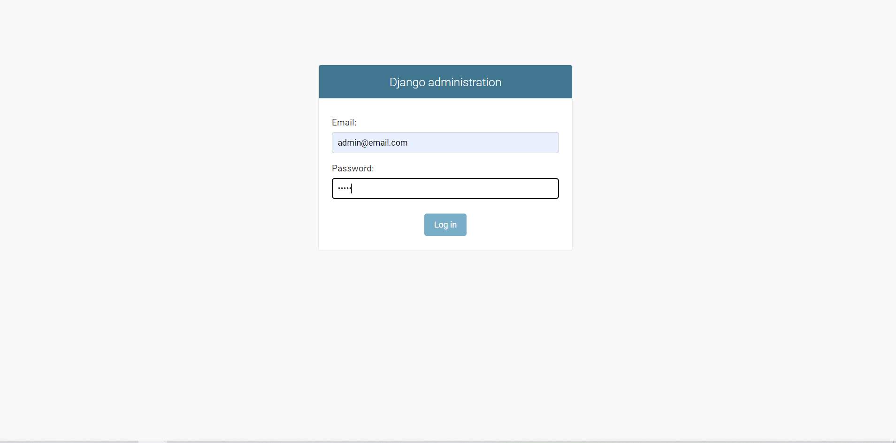
  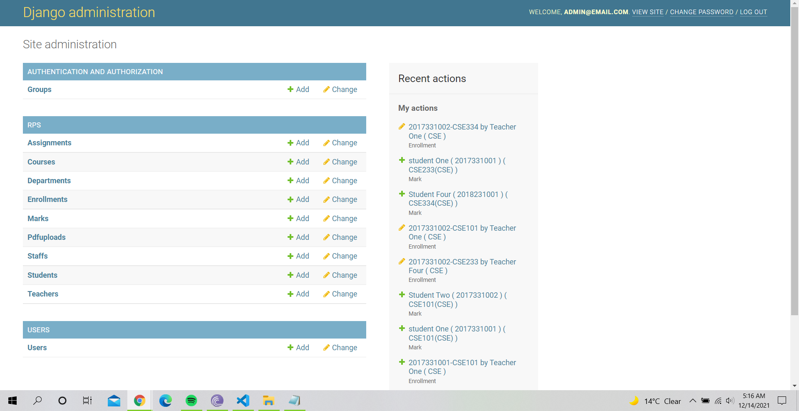
  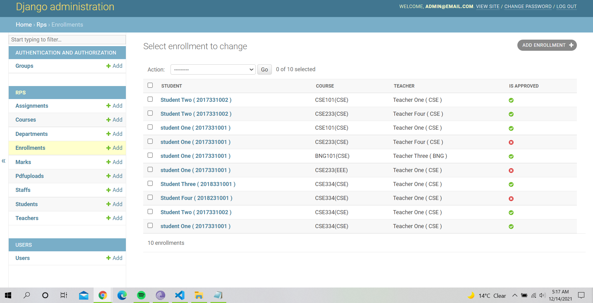
</p>
<p float="left">
  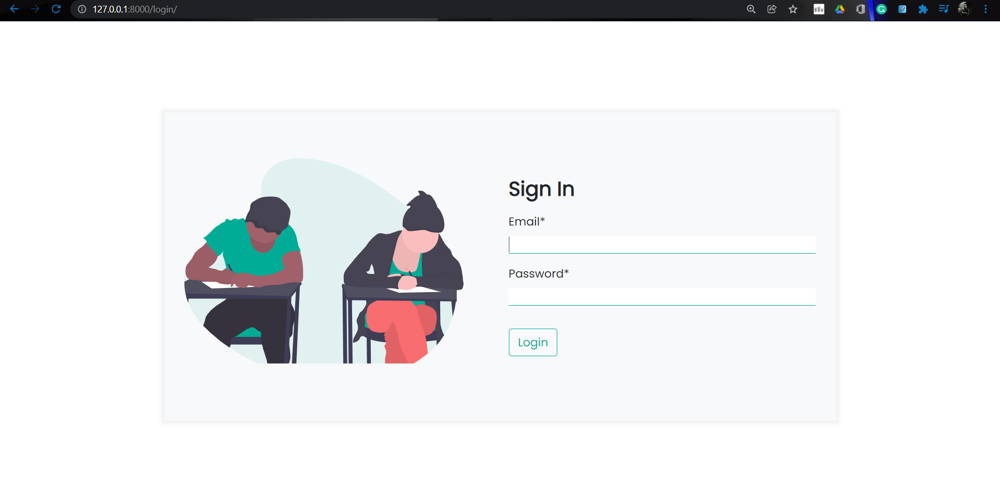
  
  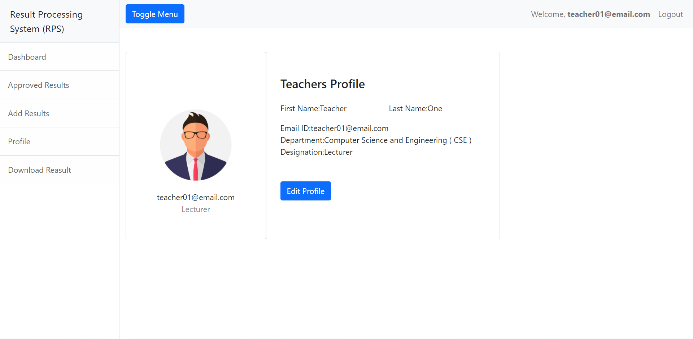
</p>
<p float="left">
  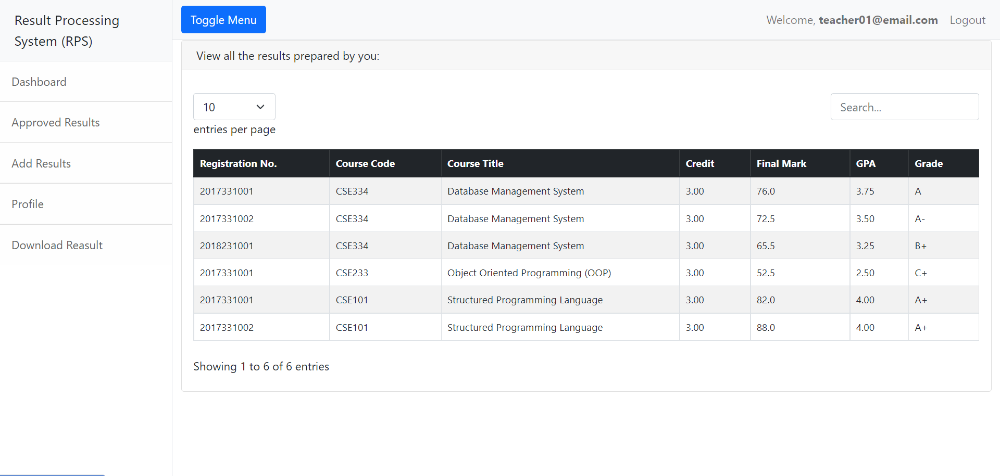
  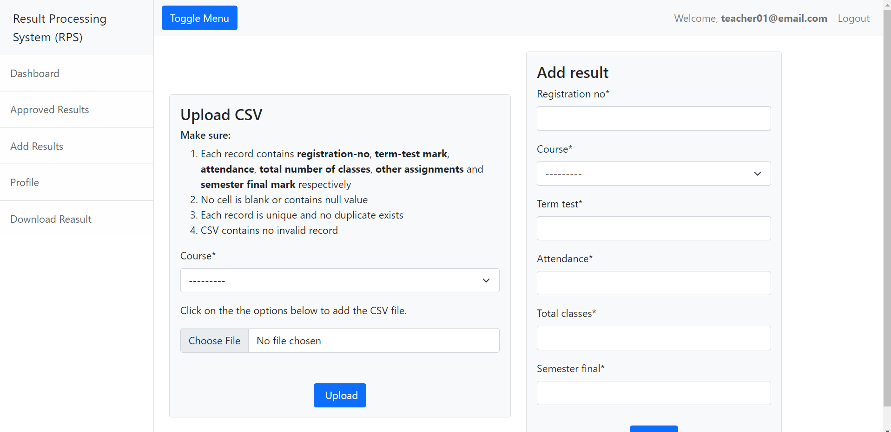
  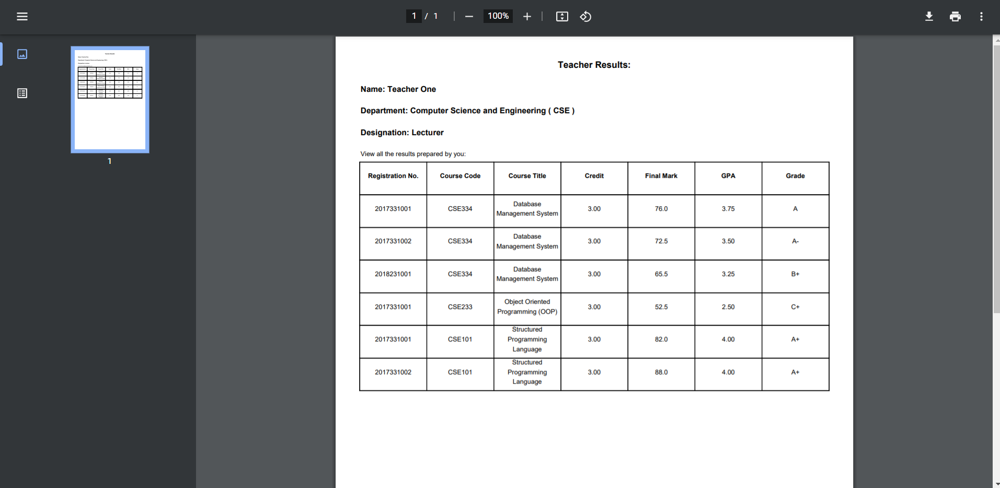
</p>
<p float="left">
  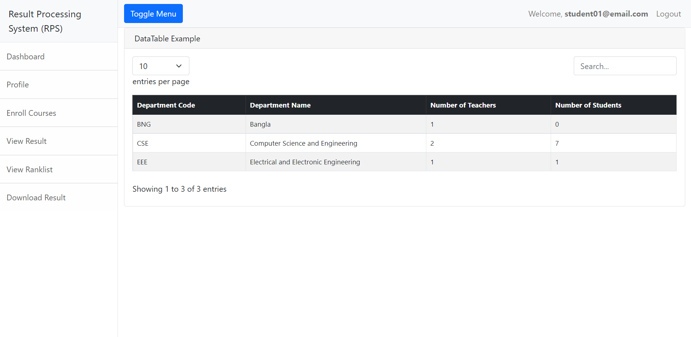
  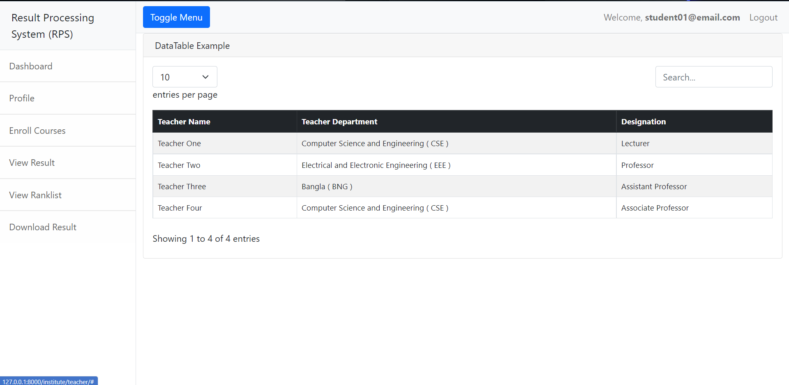
  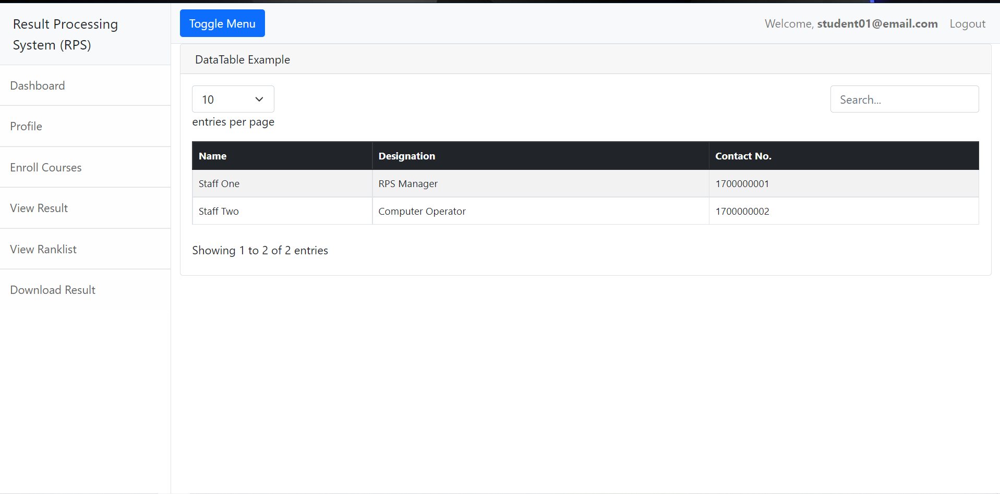
</p>
<p float="left">
  
  
  
</p>
<p float="left">
  
  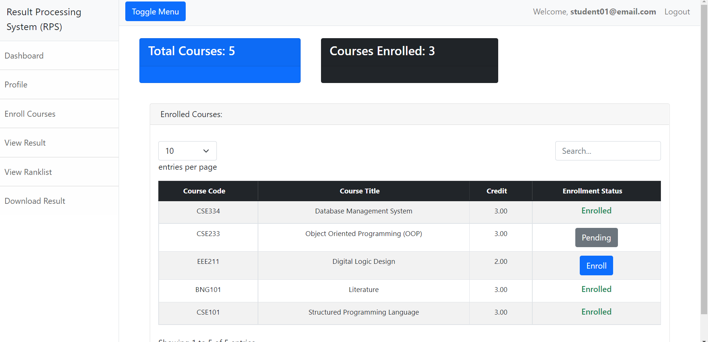
  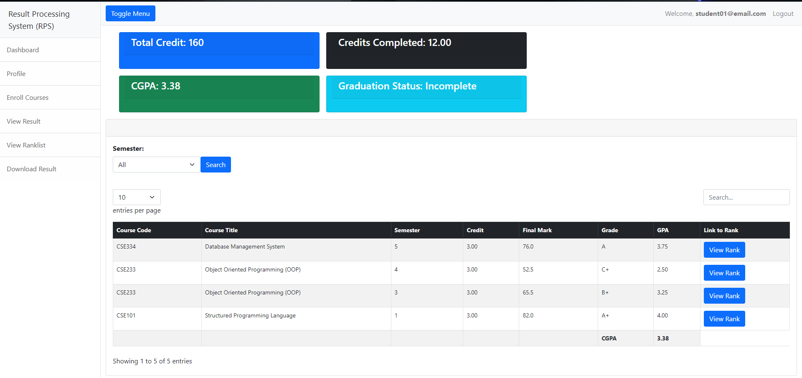
</p>
<p float="left">
  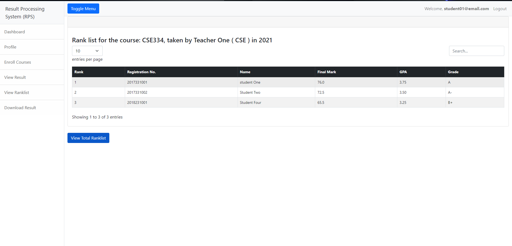
  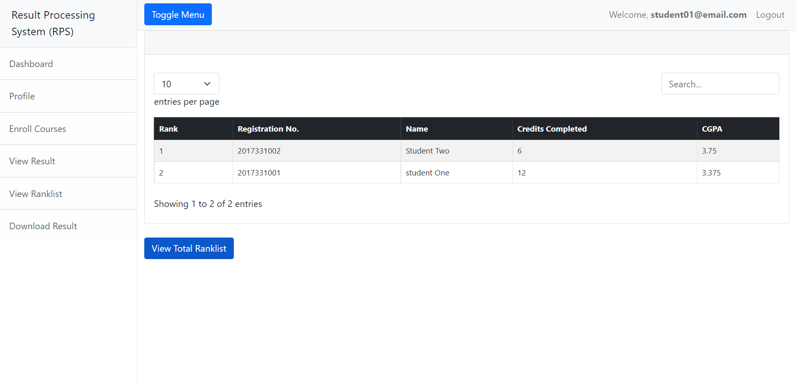
</p>


## Presentation


https://user-images.githubusercontent.com/50485574/146090277-f3b0861f-f434-4108-8ad0-2188138a68fd.mp4


## Authors
- [Abdualahil Kafi](https://github.com/abkafi001) (2017331072)
- [Sourav Saha](https://github.com/bracealround)(2017331095)
    
